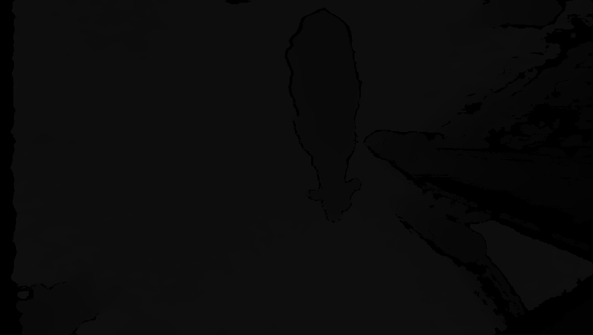
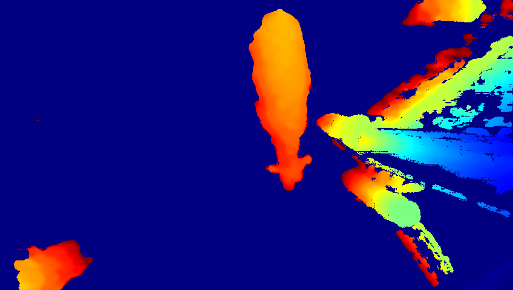
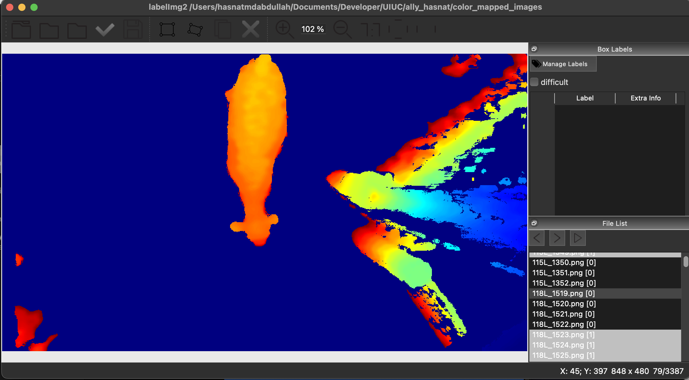

# Image Labelling: Manual to Auto Label Effort
## 0. Installation
```bash 
    cd custom_image_labelling_effort
    source setup.sh

```
## 1. Manual Labelling

### 1.1 [Optional (for Cattle Images)] Converting Tiff Depth Image Files Into Color Mapped Images

Below are side-by-side previews of the same sample image: the original TIFF depth image and its color-mapped version.

<table>
    <tr>
        <th>Depth Image Preview</th>
        <th>Color-mapped Version</th>
    </tr>
    <tr>
        <td></td>
        <td></td>
    </tr>
</table>

Both images represent the same sample, with the right image showing the color-mapped transformation of the left depth image.

- Run [src/unlabeled_tiff_processing/generate_color_mapped_images_from_unlabeled_tiff_data.py](./src/unlabeled_tiff_processing/generate_color_mapped_images_from_unlabeled_tiff_data.py) file to convert the depth values to a color mapped image.

    ```bash 
    python generate_color_mapped_images_from_unlabeled_tiff_data.py 
    --input_dir {path_to_the_tiff_img_files}  
    --output_dir {path_to_output_dir_to_the_color_mapped_imgs}
    ```


### 1.2 Manually Labelling the Color Mapped Images
 - Use LabelImg2 for cattles and run the software to manually label the cattle images

    ```
    cd labelImg2_for_cattles
    python labelImg.py
    ```
- Software Preview after importing the unlabled images


- The software will generate XML files after labelling
    <details>
    <summary>Preview of XML file</summary>

    ```xml
    <annotation verified="yes">
        <folder>color_mapped_images</folder>
        <filename>103L_5424.png</filename>
        <pathcolor_mapped_images/103L_5424.png</path>
        <size>
            <width>848</width>
            <height>480</height>
            <depth>3</depth>
        </size>
        <object>
            <name>cattle</name>
            <pose>Unspecified</pose>
            <truncated>0</truncated>
            <difficult>0</difficult>
            <robndbox>
                <cx>463.85</cx>
                <cy>165.7544</cy>
                <w>106.4597</w>
                <h>315.3407</h>
                <angle>6.203185</angle>
            </robndbox>
            <extra/>
        </object>
    </annotation>
    ```
</details>

- Import the xml labels to the workspace. For example: [data/rbbox_labels_for_images]()

- Import the unlabled images in data folder. For example: [data/unlabeled_images]()
---


## 2. Training YOLO Model from Labeled Images
### 2.1 Generate OBB label files

- Run [xml2yolo_obb.py](./src/xml2yolo_obb.py) to convert the XML label files into YOLO OBB (oriented bounding box) format labels (txt files)

- It will generate: 
    - Generates 8 normalized numbers for a bounding box as required by Ultralytics
    - Splits the images into train and validaiton sets
        - creates a dir: [splits]() in [src](./src/)
        - contains [trian.txt]() and [val.txt]()
    - Generates [data.yaml]() in [src](./src/) which will be used as a config file to train YOLO model using Ultralytics

    ```bash 
    python xml2yolo_obb.py \
    --images {path_to_images_dir} \
    --ann_xml {path_to_xml_label_files_dir}}\
    --labels {path_to_obb_labels_output_dir}\
    --val_ratio 0.2
    ```
---
### 2.2 Train YOLO on OBB task (oriented bounding box prediction)
- Run [src/train_obb.sh](./src/train_obb.sh) to train YOLO over the manually labeled images
    <details>
    <summary>Preview of the <code>train_obb.sh</code> script</summary>
- Best weights will be at [src/runs_obb/cattle_y8n_obb/weights/best.pt]() 


    ```bash
    yolo task=obb mode=train \
        model=yolov8n-obb.pt \
        data=src/data.yaml \
        epochs=80 \
        imgsz=640 \
        batch=16 \
        lr0=0.002 \
        patience=20 \
        cos_lr=True \
        project=runs_obb name=cattle_y8n_obb
    ```

    </details>
---
## 3. Bulk Auto-label the unlabled images based on the trained model
- Run [src/predict_bulk.sh](./src/predict_bulk.sh)
    <details>
    <summary>Preview of the <code>predict_bulk.sh</code> script</summary>

    ```bash
    #!/usr/bin/env bash
    set -e
    MODEL="{Best model path}"
    IN="{Path to unlabeled images dir}" 
    OUT="{Output dir where YOLO-OBB label txt files will be saved}"

    yolo task=obb mode=predict \
        model="$MODEL" \
        source="$IN" \
        save_txt=True save_conf=True \
        project=runs_obb name=pred_cattle_y8n_obb

    # Move generated labels to a separate folder
    mkdir -p "$OUT"
    find runs_obb/pred_cattle_y8n_obb/labels -name '*.txt' -exec cp {} "$OUT" \;

    echo "Auto-labels written to $OUT/"
    ```
    </details>
---
## 4. Visualize the predictions from YOLO-OBB text files
 - Run [viz_check.py](./src/viz_check.py) file to visualize the predicted bounding boxes over the images
    ```bash
    cd src
    python viz_check.py \
    --im_dir {path_to_unlabelled_images}\
    --lb_dir {path_to_label_txt_files}\
    --out_dir {path_to_ouput_image_bbox_visualization_dir}
    ```
---
## 5. Export the YOLO-OBB label text files into XML files (same as the original label imports)
 - Run [yolo_obb_2_xml.py](./src/yolo_obb_2_xml.py) to convert YOLO-OBB format to XML format labels for further use.

 ```bash
    python yolo_obb_2_xml.py 
    --im_dir ../data/unlabeled_color_mapped_images/
    --lb_dir ../data/autolabels/ 
    --out_xml ../data/autolabels_xml 
 ```
---

